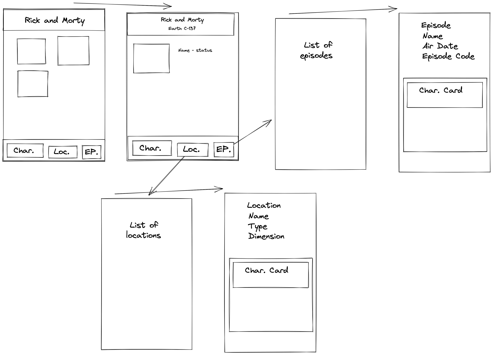

# Rick and Morty App

## Idea:

Connect all API endpoints together and display them on a webpage.

## Tasks

- Color scheme
- Font
- Components
- Pages
- HTML structure

## Components

- Header
- Footer
- Character tile (for character main page - figure)
- Character card (for episodes/location detail page)
